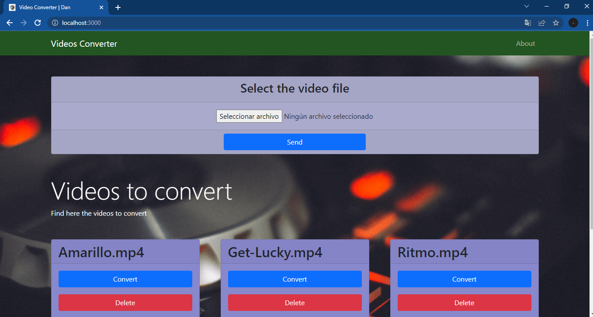

# Video Converter Web  App.

__This is a web application for convert videos to audio. Made with python3 using flask module and bootstrap framework for the css.__

## Installation.

```bash
$ git clone https://github.com/EduardYan/video-converter-web-app
$ cd video-converter-web-app

```


## Dependencies.

__Install the dependencies from the requirements file.__

```bash
$ pip3 install -r requirements.txt
```

## Run.

```bash
$ python3 index.py
```

## Configuration File.

__The file 'config.json' is a configuration file, for the server. You can set the port, the path for save the videos and audios converted.__

### Default Configuration.

```json
{
  "PORT": 3000,
  "UPLOAD_FOLDER_VIDEOS": "./static/files/videos/",
  "AUDIOS_FOLDER": "./static/files/audios/"
}
```

## Screenshot.



## Errors or Bugs.
<a href="mailto:eduarygp@gmail.com">Contact Me.</a>